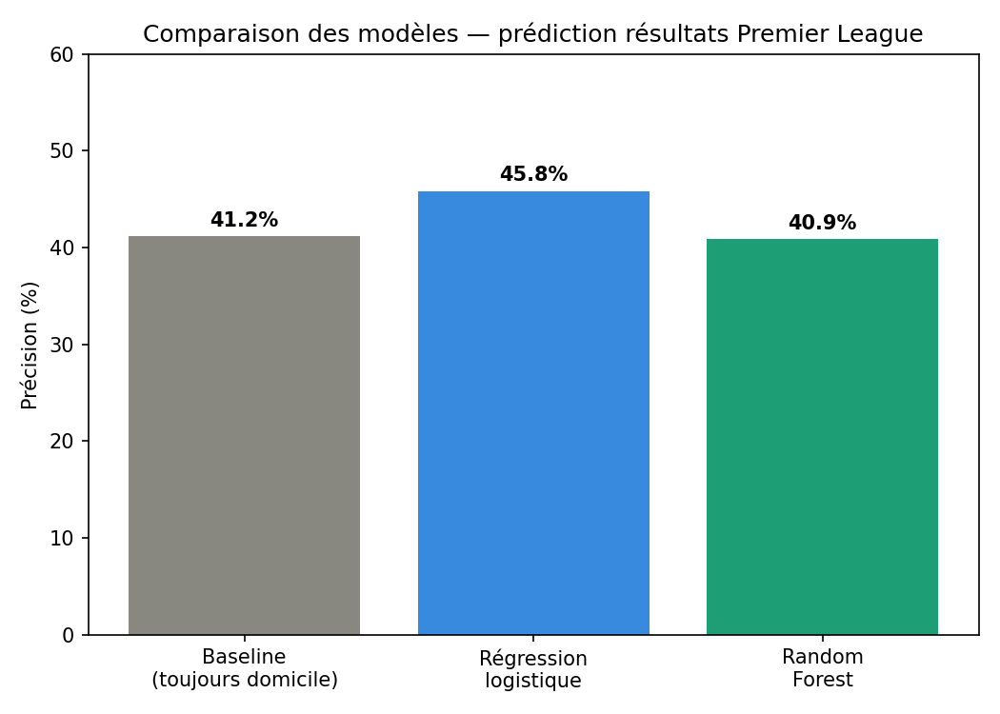

# Prédiction de résultats de matchs — Premier League ⚽

Projet de Machine Learning qui prédit le résultat d'un match de football
(victoire domicile / nul / victoire extérieur) à partir des statistiques
de forme récente des deux équipes, sur 4 saisons de Premier League
(2022/23 à 2025/26).

## Le problème

Avant un match, peut-on estimer le résultat le plus probable en se basant
uniquement sur la forme récente des deux équipes (points, buts, tirs,
corners sur les 5 derniers matchs) ?

C'est un problème de **classification multi-classes** (3 classes :
`H` = victoire domicile, `D` = match nul, `A` = victoire extérieur).

## Données

Source : [football-data.co.uk](https://www.football-data.co.uk/), licence
Open Data Commons (domaine public).

- 4 saisons de Premier League (2022/23 → 2025/26), soit 1520 matchs
- Statistiques brutes par match : score, tirs, tirs cadrés, corners,
  fautes, cartons

## Démarche

Le point clé du projet : on ne peut pas utiliser les statistiques d'un
match pour prédire... ce même match (elles ne sont connues qu'après coup).
À la place, pour chaque équipe et avant chaque match, on calcule sa
**forme glissante** sur ses 5 derniers matchs (moyenne de points, buts,
tirs, corners), en s'assurant qu'aucune fuite d'information du futur
vers le passé ne se produit (`shift(1)` avant le calcul de moyenne
glissante).

Pipeline (dossier `src/`, à exécuter dans l'ordre) :

| Script | Rôle |
|---|---|
| `01_load_data.py` | Charge et fusionne les 4 saisons, nettoie les colonnes |
| `02_build_features_part1.py` | Construit l'historique de forme glissante par équipe |
| `03_build_features_part2.py` | Recombine les features dans le format 1 ligne = 1 match |
| `04_train_model.py` | Entraîne une régression logistique, évalue sur un split chronologique |
| `05_train_random_forest.py` | Entraîne et compare un Random Forest |
| `06_summary_results.py` | Génère le graphique de comparaison final |

**Split train/test chronologique** (et non aléatoire) : on entraîne sur
les matchs les plus anciens et on teste sur les plus récents, pour
simuler une vraie situation de prédiction (on ne connaît jamais le futur
à l'entraînement).

## Résultats



| Modèle | Précision (accuracy) |
|---|---|
| Baseline naïve (toujours "victoire domicile") | 41.2% |
| **Régression logistique** | **45.8%** |
| Random Forest | 40.9% |

La régression logistique dépasse la baseline naïve de ~4.6 points, ce qui
montre que la forme récente contient un signal prédictif réel, mais
limité — le football reste un sport avec une part de hasard importante,
surtout pour les matchs nuls (peu prévisibles : le modèle les prédit
rarement correctement). Le Random Forest, malgré sa réputation de modèle
plus puissant, fait légèrement moins bien ici — probablement parce que le
dataset (1200 matchs d'entraînement) est trop petit pour exploiter sa
flexibilité, un cas classique illustrant qu'un modèle plus complexe n'est
pas toujours meilleur.

Les features les plus importantes (selon le Random Forest) sont liées
aux tirs et tirs cadrés récents, plus qu'au nombre de points — un
indicateur plus fin de la performance qu'un simple résultat W/D/L.

## Pistes d'amélioration

- Ajouter l'historique des confrontations directes entre les 2 équipes
- Intégrer le classement / nombre de points dans la saison en cours
- Ajouter le repos entre matchs (fatigue, calendrier chargé)
- Tester un gradient boosting (XGBoost / LightGBM)
- Gérer le déséquilibre des classes (peu de nuls) avec du resampling

## Installation et exécution

```bash
pip install -r requirements.txt
cd src
python 01_load_data.py
python 02_build_features_part1.py
python 03_build_features_part2.py
python 04_train_model.py
python 05_train_random_forest.py
python 06_summary_results.py
```

## Structure du projet

```
.
├── raw_data/          # CSV bruts téléchargés (football-data.co.uk)
├── data/              # Données nettoyées et features (générées par les scripts)
├── src/               # Scripts du pipeline, à exécuter dans l'ordre
├── outputs/           # Modèles entraînés sauvegardés (.pkl)
├── results/           # Graphique et résumé des résultats
└── requirements.txt
```

## Stack technique

Python · pandas · scikit-learn · matplotlib
# premier-league-match-predictor
Machine Learning project for Premier League match prediction using Logistic Regression and Random Forest.
